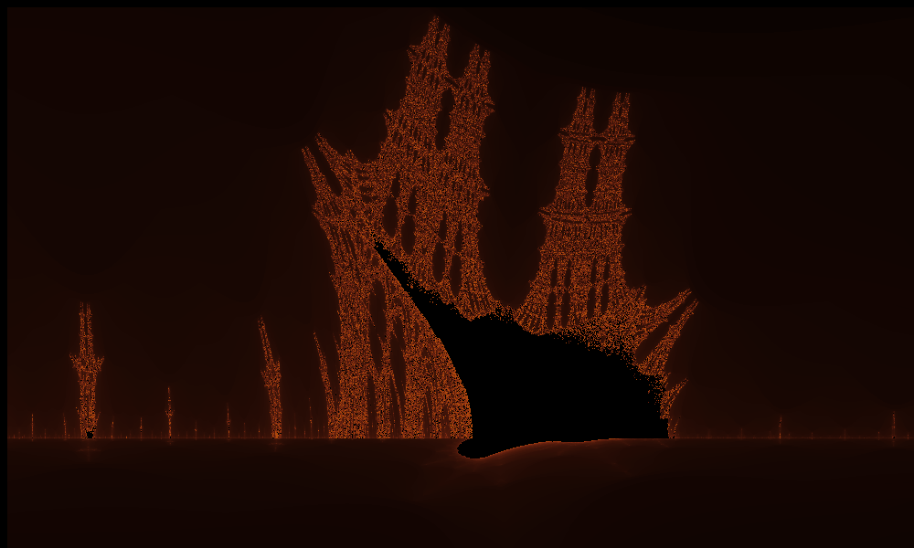
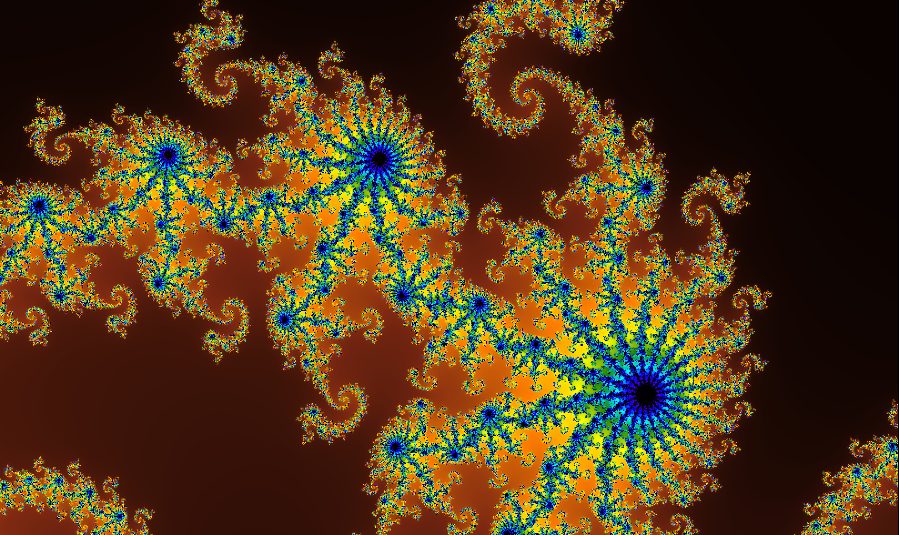

# Mattoni

Mattoni is an interactive fractal explorer.

### Setup

First, you must have [GCC](https://gcc.gnu.org) and [SDL2](https://www.libsdl.org/download-2.0.php) installed on your system. After you're set up, run `make` from the project's main folder to compile Mattoni. To remove the compiled executable and any generated object files, run `make clean`.

### Usage

Run `./main` from the main directory to start Mattoni. First you'll be prompted to select one of three fractals to display. If you select Julia sets, you'll be promped further to enter an integer seed.  

After that, in the window that opens, you can:

+ Click and drag a box to zoom in on an area
+ Pan using `H/J/K/L` or the arrow keys
+ Zoom in with either `U` or `Return`
+ Zoom out with either `N` or `Spacebar`
+ Save a bitmap screenshot to the `out` folder simply by pressing `S`.

### Authors

Crafted with care by Marc-André Brochu and Marcel Goh, exchange students at Charles University, for HackPrague 2019 (4-5 May).  

Named after the best drink ever.

