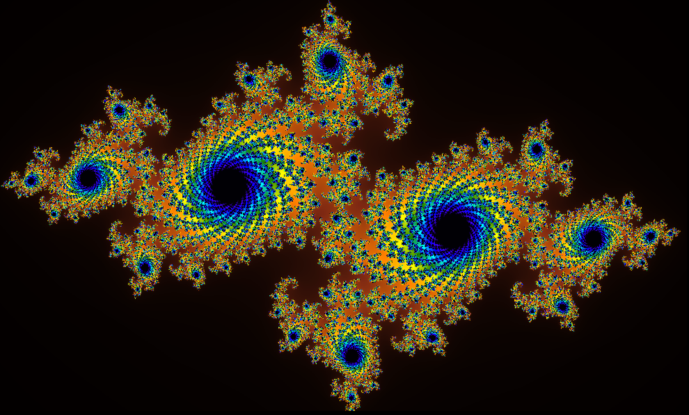
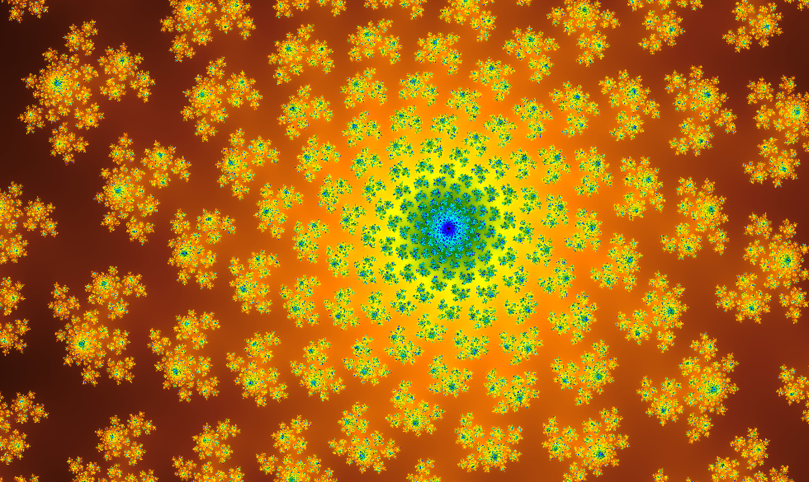

# Mattoni

Mattoni is an interactive fractal explorer.

### Setup

First, you must have [GCC](https://gcc.gnu.org) and [SDL2](https://www.libsdl.org/download-2.0.php) installed on your system. To compile, run `make` from the project's main folder. To remove the compiled executable and any generated object files, run `make clean`.

### Usage

Run `./main` from the main directory to start Mattoni. In the window that opens, you can:

+ Click and drag a box to zoom in on an area
+ Pan using `H/J/K/L` or the arrow keys
+ Zoom in with either `U` or `Return`
+ Zoom out with eiter `N` or `Spacebar`

### Authors

Crafted with care by Marc-André Brochu and Marcel Goh, exchange students at Charles University, for HackPrague 2019.  

Named after the best drink ever.

